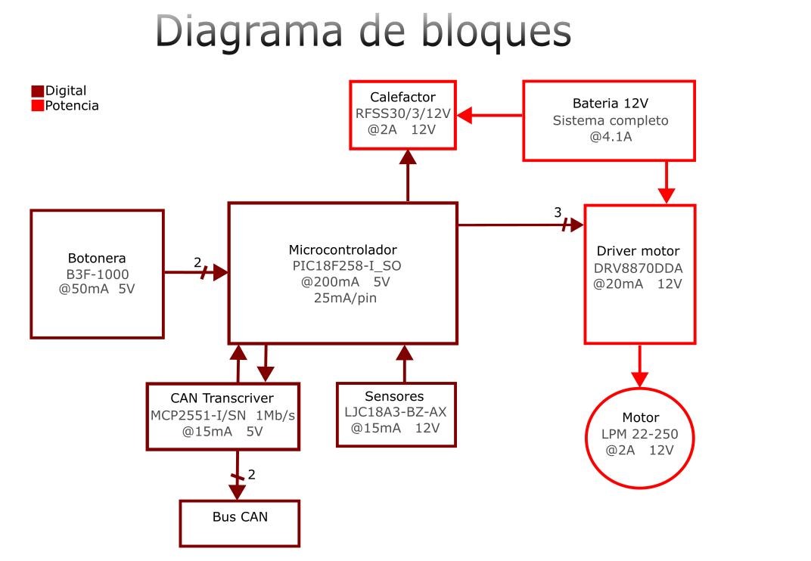

View this project on [CADLAB.io](https://cadlab.io/project/29036). 

# Proyecto Maletero

## Autores
- Eric Trejo Sanchez (@ItsErix11)
- Eloi Ortega Ortiz (@EloiOrtega)

## Versió - v1.0 ## Curs - Assignatura de Disseny de PCBs amb KiCad - [Curs 2024-2025]

## Objetivo 
Nuestro objetivo es crear un sistema controlador del maletero de un coche que pueda cumplir las funciones de abrir y cerrar el maletero con un motor, desempañar el cristal de este y que se pueda abrir con un sensor con el pie en el caso de tener las manos ocupadas

## Requisitos i especificaciones
- Control del motor de apertura/cierre del maletero
- Sistema de calefacción para desempañar el cristal
- Sensor de movimiento para apertura sin contacto
- Interfaz CAN para comunicación con otros sistemas del coche
- Protección contra sobrecorriente en el control del motor

## Diagrama de bloques 

## Tabla de componentes
| Descripció | Manufacturer Number | Package | Datasheet | Proveïdor | Unitats |
|------------|--------------------|---------|----------|----------|---------|
| LDO Voltage Regulators 5A L Drop Pos Fixed Regs | LT1084-5 | ... | https://eu.mouser.com/datasheet/2/609/1083ffe-3123432.pdf | MouserElectronics | 1 |
| MCU 32 KB FL 1536 RAM 25 I/O | PIC18F2580T-I/SO | ... | https://eu.mouser.com/datasheet/2/268/39637d-3443674.pdf | MouserElectronics | 1 |
| Full-Bridge Motor Driver Dual | L298HN | ... | https://cdn.sparkfun.com/assets/7/1/d/6/c/Full-Bridge_Motor_Driver_Dual_-_L298N.pdf | sparkfun | 1 |
| CAN Interface IC Hi Spd CAN Transceiv | MCP2551-I/SN |  | https://eu.mouser.com/datasheet/2/268/20001667G-3441642.pdf | MouserElectronics | 1 |
| Operational Amplifiers - Op Amps LOW PWR SGL OP AMP A 926-LM321MF/NOPB | LM321MFX/NOPB |  | https://www.ti.com/lit/ds/symlink/lm321.pdf?ts=1742974140204&ref_url=https%253A%252F%252Fwww.ti.com%252Fproduct%252FLM321%253FkeyMatch%253DLM321%2526tisearch%253Duniversal_search%2526usecase%253DGPN-ALT | TexasInstruments | 1 |

## Funcionalidades
1. **Control del maletero**:
   - Apertura y cierre mediante motor controlado por el MCU
   - Protección antipinch mediante detección de corriente
   
2. **Sistema de desempañado**:
   - Calefacción controlada por botones para regulación de temperatura
   
3. **Apertura sin contacto**:
   - Sensor de movimiento para detección del pie

4. **Interfaz de comunicación**:
   - Protocolo CAN para integración con otros sistemas del coche
   - Posibilidad de control remoto desde la llave o panel central

## Historial de cambios 
| Data | Autor | Branch | Descripció |
|------|------|--------|------------|
| 2025-04-09 | Eloi | `main` | Corrección de errores de clase |
| 2025-04-09 | Eric | `main` | DRC errores 0, warnings 25 |
| 2025-04-09 | Eloi | `main` | Ultimos ajustes de islas del GND |
| 2025-04-08 | Eloi | `main` | Actualización de huella |
| 2025-04-08 | Eric | `main` | Reglas de diseño, 0 errores y separación de componentes |
| 2025-04-08 | Eric | `main` | Par diferencial CAN |
| 2025-04-08 | Eloi | `main` | Corrección de reglas de diseño del layout | 
| 2025-04-04 | Eloi | `main` | Layout v1.2 acabado |
| 2025-04-02 | Eloi | `main` | Corrección de errores del layout |
| 2025-04-02 | Eric | `main` | Esquematico y diagrama acabados |
| 2025-04-01 | Eloi | `main` | Layout final v.1, routing terminado |
| 2025-04-01 | Eric | `main` | Arreglos del GNDPWR y GND |
| 2025-04-01 | Eloi | `main` | Actualización del layout, capas top suprimidas |
| 2025-04-01 | Eric | `main` | Capas de cobre del layout y DE-9 |
| 2025-04-01 | Eloi | `main` | Actualización del layout |
| 2025-04-01 | Eloi | `main` | Layout placement |
| 2025-04-01 | Eloi | `main` | Creación del layout |
| 2025-04-01 | Eric | `main` | Arreglos esquemático |
| 2025-04-01 | Eloi | `main` | Huellas añadidas al esquematico |
| 2025-04-01 | Eloi | `main` | Cambio de sensor en el esquemático |
| 2025-03-31 | Eric | `main` | Adición del DE-9 y regulador del sensor del esquemático|
| 2025-03-30 | Eloi | `main` | Corrección de errores del esquemático |
| 2025-03-30 | Eric | `main` | Esquemático ordenado |
| 2025-03-29 | Eloi | `main` | Corrección del switch y net lists del esquemático |
| 2025-03-29 | Eric | `main` | Mas correcciones del esquemático |
| 2025-03-27 | Eric | `main` | Correcciones de orden y conectores del esquemático|
| 2025-03-26 | Eloi | `main` | Adición de Net lists, corrección de errores y regulador de tensión del esquematico |
| 2025-03-25 | Eric | `main` | Conector del Program |
| 2025-03-25 | Eric | `main` | Diagrama de bloques añadido |
| 2025-03-25 | Eric | `main` | Rth mas disperso |
| 2025-03-25 | Eric | `main` | Corrección del CAN y separación |
| 2025-03-25 | Eric | `main` | Adición de condensadores de desacoplo |
| 2025-03-25 | Eloi | `main` | Versión casi final |
| 2025-03-25 | Eric | `main` | Transcriver CAN, casi todo el MCU completado |
| 2025-03-24 | Eloi | `main` | Corrección de errores |
| 2025-03-24 | Eloi | `main` | Resistencia termica añadida |
| 2025-03-24 | Eric | `main` | Pruebas del proyecto |
| 2025-03-24 | Eric | `main` | Cristal añadido |
| 2025-03-24 | Eric | `main` | Reorganización y corrección de errores |
| 2025-03-24 | Eloi | `main` | Etapa de regulación (LT1117) |
| 2025-03-24 | Eric | `main` | Adición de conectores |
| 2025-03-24 | Eric | `main` | Creación del proyecto |

