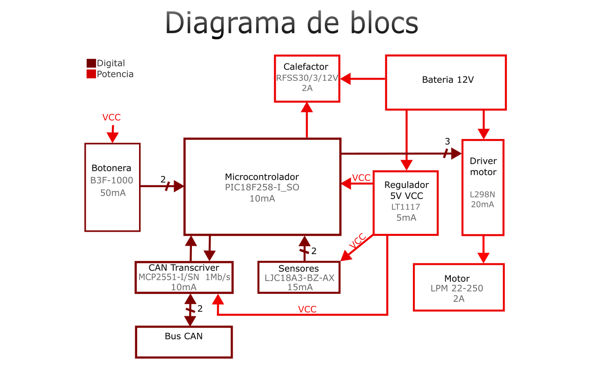

View this project on [CADLAB.io](https://cadlab.io/project/29036). 

# Proyecto Maletero

## Autors
- Eric Trejo Sanchez (@ItsErix11)
- Eloi Ortega Ortiz (@EloiOrtega)

## Versió - v1.0 ## Curs - Assignatura de Disseny de PCBs amb KiCad - [Curs 2024-2025]

## Objectiu 
Nuestro objetivo es crear un sistema controlador del maletero de un coche que pueda cumplir las funciones de abrir y cerrar el maletero con un motor, desempañar el cristal de este y que se pueda abrir con un sensor con el pie en el caso de tener las manos ocupadas

## Requisits i especificacions
- Llista de requisits tècnics i objectius a assolir.

## Diagrama de blocs (Afegiu una imatge del diagrama de blocs)

## Taula de components
| Descripció | Manufacturer Number | Package | Datasheet | Proveïdor | Unitats |
|------------|--------------------|---------|----------|----------|---------|
| LDO Voltage Regulators 5A L Drop Pos Fixed Regs | LT1084-5 | ... | https://eu.mouser.com/datasheet/2/609/1083ffe-3123432.pdf | MouserElectronics | 1 |
| MCU 32 KB FL 1536 RAM 25 I/O | PIC18F2580T-I/SO | ... | https://eu.mouser.com/datasheet/2/268/39637d-3443674.pdf | MouserElectronics | 1 |
| Full-Bridge Motor Driver Dual | L298HN | ... | https://cdn.sparkfun.com/assets/7/1/d/6/c/Full-Bridge_Motor_Driver_Dual_-_L298N.pdf | sparkfun | 1 |
| CAN Interface IC Hi Spd CAN Transceiv | MCP2551-I/SN |  | https://eu.mouser.com/datasheet/2/268/20001667G-3441642.pdf | MouserElectronics | 1 |
| Operational Amplifiers - Op Amps LOW PWR SGL OP AMP A 926-LM321MF/NOPB | LM321MFX/NOPB |  | https://www.ti.com/lit/ds/symlink/lm321.pdf?ts=1742974140204&ref_url=https%253A%252F%252Fwww.ti.com%252Fproduct%252FLM321%253FkeyMatch%253DLM321%2526tisearch%253Duniversal_search%2526usecase%253DGPN-ALT | TexasInstruments | 1 |

## Funcionalitats
- Abrir y cerrar el maletero
- Calefactor para el cristal 
- Sensor de apertura

## Historial de canvis | Data | Autor | Branch | Descripció |
|------|------|--------|------------| | 2025-03-14 | Nom | `main` | Creació del projecte |
